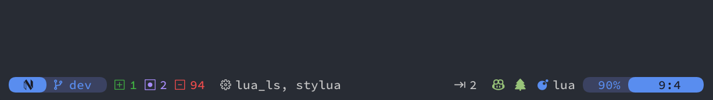

## preview

# auto-lsp.nvim
- auto-lualine.nvim is an automatic configuration for lualine.nvim
# Instalation
- Lazy
```lua
return {
  {
    "pojokcodeid/auto-lualine.nvim",
    event = { "InsertEnter", "BufRead", "BufNewFile" },
    dependencies = { "nvim-lualine/lualine.nvim" },
    config = function()
      require("auto-lualine").setup()
    end,
  },
}
```
